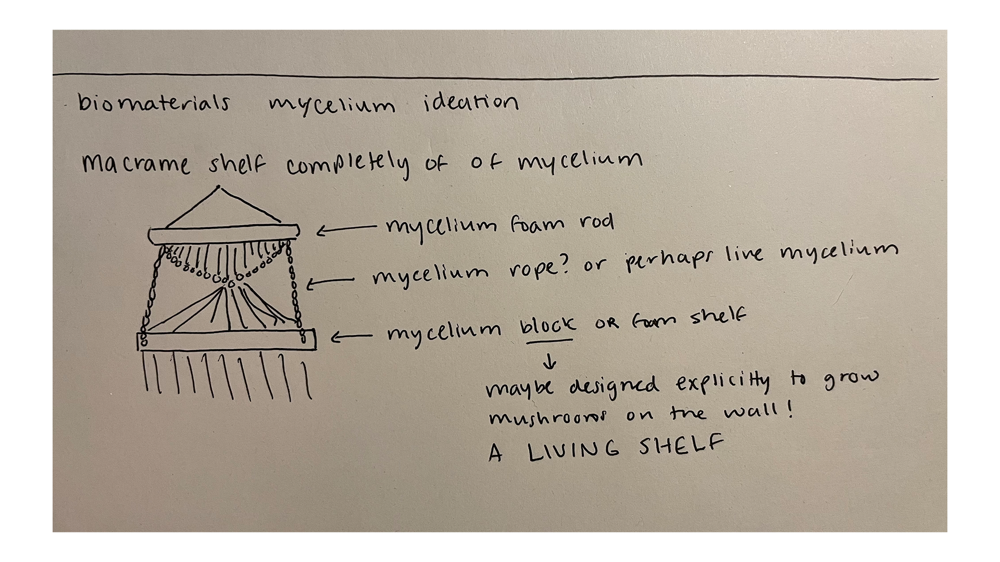

## A Shelf

Something I've been into lately, despite not really matching the aesthetic or the design of my bedroom, is macrame. It is a type of textile generally using a type of rope to knot together in generally geometric shapes. The outcome is usually very lovely and natural looking. 

Personally, I have been looking into building my own shelf. Something similar to this:

My issue, is that I don't necessarily _love_ it. How can I create something that is a little more personal?

## References

My initial findings took me to pinterest, who better to ask than DIY moms! One of the first things I found was [a 2009 blogspot using dried fungi as pieces of the shelf, replacing wood](http://findermaker.blogspot.com/2009/09/mushroom-shelf-tutorial.html)

This explores mushroom preservation and effectively replaces floating wood shelves. A cool idea! But not necessarily what I am shooting for. 

## A LIVING Shelf

So, what if I had personal stakes literally tied into the shelf?

I would love to create a shelf completely out of mycelium and actually see whether or not it could operate as a vessel to hold, and as a living, breathing thing. 

Here is the breakdown of the parts:

## Initial Approach 

There are effectively 2 different parts of this:
1. The "rope"
2. The "wood"

The "wood" would be a mycelium block -- I'm not sure whether it should contain soil or simply be a foam.

The "rope" would be the live mycelium, I'm wondering how to enforce the growth to be in this way and what the maintenance would be like to care for the shelf. 