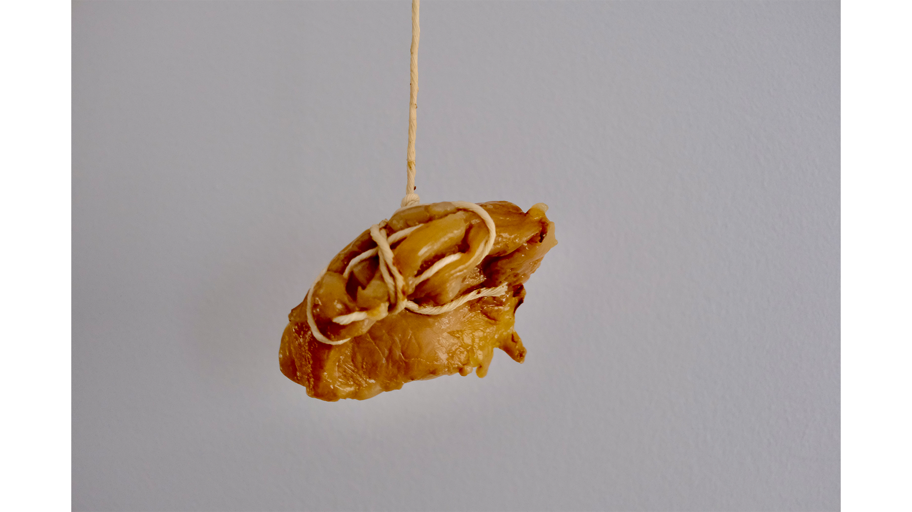
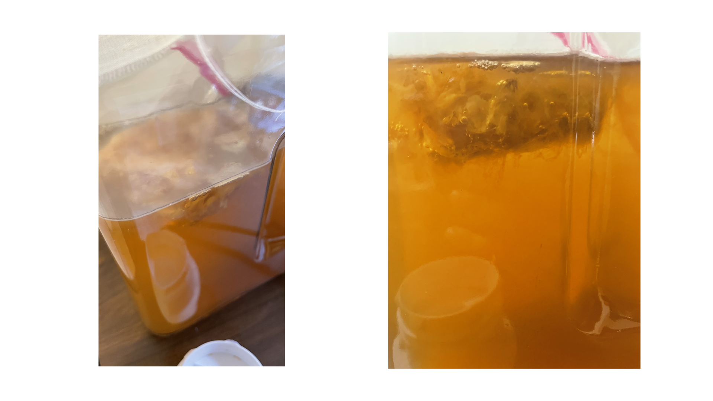

## SCOBY Experiments: On the Violence of the Vulva

# Content Warning
The below images might be grusome or triggering, and this serves as a content warning.

The inspiration of this piece revolves not around bondage culture, but around the control of women's bodies in the United States speficially. With the hanging string, it feels like a crucifixtion.

One issue I was running into however was that these are "fresh" images, but my SCOBY did not dry during the week because my apartment is so cold. 

## On Making Booch

## Bacterial Cellulose Idea

Focusing on environmental awareness and the feasibility of using bacterial cellulose as a material for a product I use often -- I think it would be so interesting to play with the concept of creating a game console completely from reusuable parts. Initially I had more broadly defined thoughts such as computers or other predominant technology, but if there is one person I admire from childhood it would be David Cronenberg. 

Despite my distaste for VR in general, I think there is some respite in escapism. This isn't necessarily always a good thing, however, but the Black Mirror episode *San Junipero* discusses an afterlife where people can exist in a virtual space beyond death. If we can create a definitive virtual space using biomaterials, would that not be similar to a natural burial? Obviously this seems out of the picture now, but as we see natural burials being more and more prevlant (a natural burial does not include any chemical elements in the process, so no embalming and no coffin but wrapped in cloth), it seems fitting that we could find a solution that would be able to recreate the afterlife in the future.

What I would imagine is both a physical console and some sort of virus or bacterium that would be injected into a person immediately post-mortem. Similar to the way the current existing embalming process happens now. Then after the virus spread its way through the body, the virus would transfer to the phsyical console. This effectively is a copied "soul" of the person that will continue to exist in the bacterium.

Some considerations:
* Power -- At this moment I don't know how the console would be powered. Would it subsist on itself until the end of time? Would the "soul" be able to persist or is there a second death?
* Storage -- Who maintains the storage of the console?

## Readings

# Overview of bio fabrics from biolab at IAAC in Barcelona:

[youtube video](https://www.youtube.com/watch?v=VPUX7nRlYAU&t=456s)

Shoe made out of bioplastics —

- create luxury from biomaterials
- magic of biomaterials — can control to explore new aesthetics given by natural materials
- MUSHROOM IS THE FUTURE
- they have closed loop for PLA material (they re-extrude materials

# Anicka Yi on Nonhuman Ecologies and Embodied Machines:

[podcast](https://podcasts.apple.com/us/podcast/anicka-yi-on-nonhuman-ecologies-and-embodied-ma
chines/id1332021431?i=1000470823168)

- what happens after machine and human are no longer different
- scent making and having AI identify and create scents
- smell is a **tool** of human communication
- smell is a sight for political, biological discourse
    - sight attributed to masculine
    - smell given feminine attribute — hard to describe and hard to talk about
- *rethink what the human is*
- power functions to distinct between life vs non-life
- defining viruses as being alive

# Jenna Sutella on bacteria and AI:

[website](https://www.aqnb.com/2021/08/22/jenna-sutela-for-new-mystics-bacteria-wetware-psych
edelic-silicon-valley-in-the-latest-from-the-artist-ai-collaborative-writing-project/)

- what we talked about in class with generative text
- removing anthropocentric aspect of AI
    - consumer and producer of data
- does the AI try to communicate w the bacteria?
    - jk
    - **go beyond language** — I want to dismantle it as much as possible — and
    find instances in the human world where there are those more unconscious utterances or forms of communication
    - layers of mediation
- Bacteria were the **first** to breathe air and to swim; through fermentation and other macroscopic processes, they perform the backstage metabolic
acts that sustain all forms of life; they carry with them traces of
material histories of the Earth and quite possibly other planets
- The Wall of Entropy [wall of entropy](https://medium.com/asecuritysite-when-bob-met-alice/the-wall-of-entropy-making-cyber-security-fun-f17c780bedc2)
- Sutela developed a series of lamps shaped like her head, with an
immaterial attaché in the form of an iOS app (co-developed with Atken
and poet-programmer Allison Parrish), that together use machine
intelligence to divine daily cosmo-technic readings.
- *This is what happens with our machines — we’re a**utomating the idea of those emotions** or feelings*

# Maru Garcia working with BC:

[Maru Garcia Blog](https://www.lapl.org/collections-resources/blogs/lapl/interview-artist-maru-garcia)

transdisciplinarity means that knowledge can be obtained through the
sciences (physical, earth, and life sciences, social sciences), but also through the arts and other sources of knowledge

value the process over the results. I start with an idea and then that idea starts to develop in different ramifications like dendritic growth where new connections are formed. I give room to the unexpected, allowing the system to develop itself. That is why I like to work with living organisms or biosystems because I can receive a response. It's like a conversation.

My art practice wants to start by raising awareness about the environmental crisis we live in, through research of contaminated sites, but also by proposing solutions for transforming humans into remediators and healers instead of exploiters.