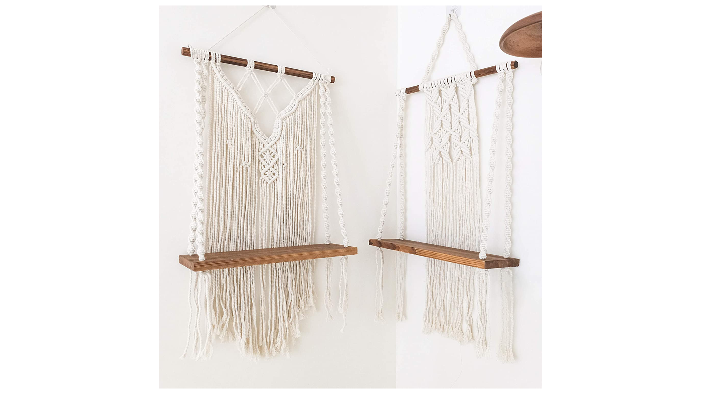
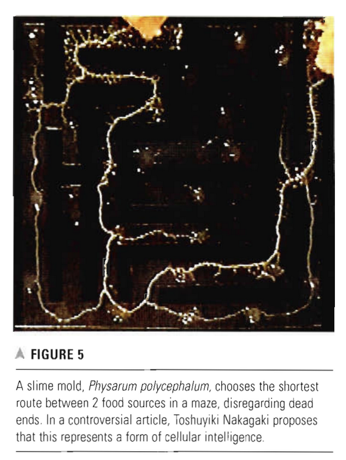

## Mycelium Ideation
# A Shelf

Something I've been into lately, despite not really matching the aesthetic or the design of my bedroom, is macrame. It is a type of textile generally using a type of rope to knot together in generally geometric shapes. The outcome is usually very lovely and natural looking. 

Personally, I have been looking into building my own shelf. Something similar to this:

My issue, is that I don't necessarily _love_ it. How can I create something that is a little more personal?

# References

My initial findings took me to pinterest, who better to ask than DIY moms! One of the first things I found was [a 2009 blogspot using dried fungi as pieces of the shelf, replacing wood](http://findermaker.blogspot.com/2009/09/mushroom-shelf-tutorial.html)

This explores mushroom preservation and effectively replaces floating wood shelves. A cool idea! But not necessarily what I am shooting for. 

# A LIVING Shelf

So, what if I had personal stakes literally tied into the shelf?

I would love to create a shelf completely out of mycelium and actually see whether or not it could operate as a vessel to hold, and as a living, breathing thing. 

Here is the breakdown of the parts:

# Initial Approach 

There are effectively 2 different parts of this:
1. The "rope"
2. The "wood"

The "wood" would be a mycelium block -- I'm not sure whether it should contain soil or simply be a foam.

The "rope" would be the live mycelium, I'm wondering how to enforce the growth to be in this way and what the maintenance would be like to care for the shelf. 

## Readings

[carrier bag response anna tsing](https://tankmagazine.com/tank/2021/06/carrier-bag-anna-tsing)

Feral Atlas

- “feral” ecologies“ or “ecologies that have
been encouraged by human-built infrastructures, but which have developed and spread beyond human control”

Ursula K Le Guin - carrier bag theory

to tell stories of terrible things that are happening in an engaging,
passionate way that doesn’t paralyse listeners, but instead makes them,
in Donna Haraway’s words, “stay with the trouble”: to engage with the
kinds of problems they were involved in rather than running away from
them.

Smell, which makes us jump from one domain to another without even
realizing that we’ve moved into another domain, is a great asset to that unlearning of a particular set of modernist visual prejudices

If languages are carrier bags or assemblages, they gather and carry meaning and history differently

The point of language that is so important in shamanic practice is to
create a kind of attunement between the body of the shaman and the world

Attunement is a form of love or, at least, commitment, responsibility,
care, attention. Learning to smell the matsutake mushroom gives me this
moment of attunement, where it enters my lifeworld, now we inhabit
together and live with each other in a way that we were not before

[readings](https://drive.google.com/drive/folders/1GlU9xjSAfOlAitEFlDzqMkrVcVjqxBTu?usp=sharing)

# Mycelium as Natures Internet

Toshuyiki Nakagaki

- research done on determining sentient life within mycelium

using mycelia as natural sensors

string theory?

# Living Labrinths

octavia butler on slime molds

basically listing types of sensors

How, then, do sensory data streams come together within a mycelial
network? How do brainless organisms link perception with action?

hyphal tips are where data streams come together

discsussing a fungal computer

- It is as if you had stuck a pin in your toe, detected the nerve
impu melse that traveled through your body, but hadn’t been able to measure
your reaction to the pain.
    
    are we forcing an evolution so we can leverage it? is this really multispecies?
    

> The Latin root of the word intelligence means
“to choose between.” Many types of brainless organisms—plants, fungi,
and slime molds included—respond to their environments in flexible ways,
