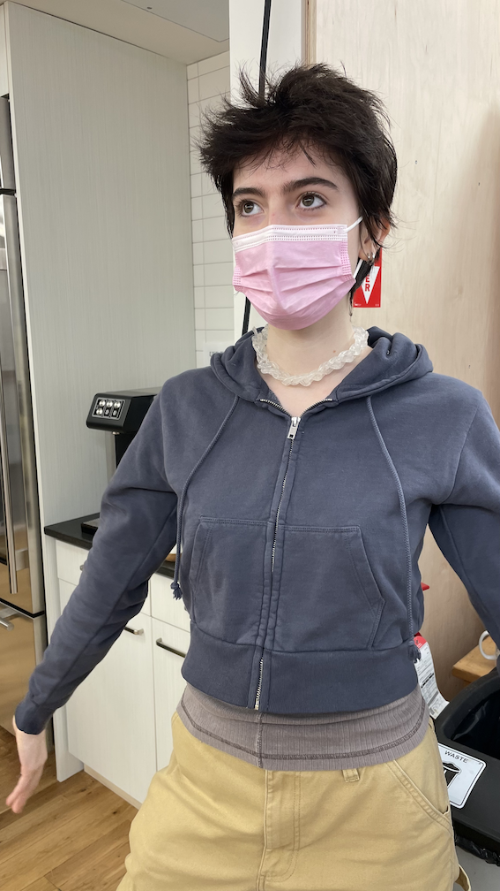

## Bioplastics

[slides](https://docs.google.com/presentation/d/1ngFmHJ4WyYPC3018SxSwtnaJ4wxtQWuFSOjfR25MSJs/edit#slide=id.g100c2c66bde_0_100)

I explored with Agar Agar Foam -- this is definitely something I will be using for prototyping in the future!!

Here is also some bio-yarn knitting with @chaski in class

## Readings
# General Ecology: With Plants
# Idea of Intelligence

- mysticism, weirdness, and women becoming plants
- interacting with other lifeforms is taught out of us
- *intelligence is anthropormorphized*
- everything underwater lives in a world of sound and vibrations
- intelligence is a tool to resonate familiarity, an aspect of life
- plant thinking is not plant intelligence

still more likely to prescribe intelligence to voice assistants such as alexa and google home

# Multispecies Worldbuilding Lab

- botany might have potential as a place of resistance and art pedagogy
- "eco-queer" way of living
- weed is "invasion" of suburban living
- invasion
    - weed is queerness

[readings below](https://drive.google.com/drive/u/0/folders/1TKT53AfVZSqK0718jbmJjuh1EGBaZ0TN)
# Hidden Life of Trees
# Interspecies Architecture
# Plastiglomerate