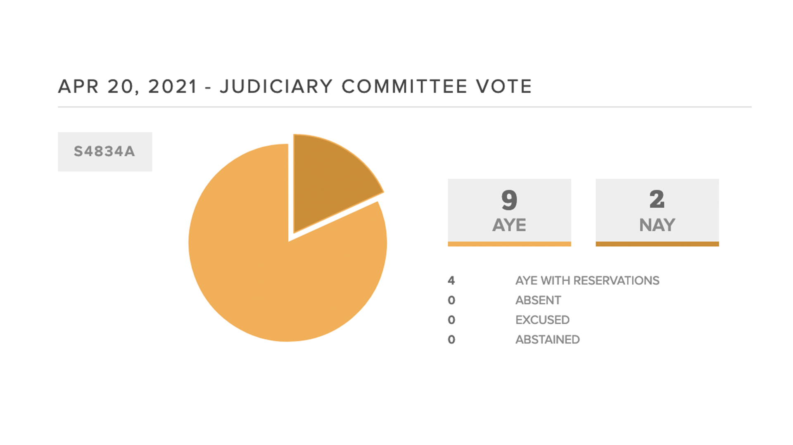

## Readings

[podcast](https://player.fm/series/why-are-people-into-that/sex-work-feminism-lecture-skidmore-college-317)

Towards an Anthropology of Women by Reina R. Reiter

## Response

Tina Hold says sex work is a public health crisis -- carrying condoms can be evidence as participating in sex work. This intrigued me, and I checked the laws of New York State. As of 2013, it is now illegal to use contraception as evidence for sex work. 

[urban justice center article on sex work](https://swp.urbanjustice.org/2019/09/21/new-york-state-assembly-bill-s1379-a2305-condom-bill/)

And this is the updated and maintained legislation as of 2021.

[current new york legislation](https://www.nysenate.gov/legislation/bills/2021/S4834)

One thing I find fascinating and sad is the amount of `Aye, with reservations`. *Four* legislators had RESERVATIONS about removing the use of contraception as evidence. Personally, I carry condoms and lube with me and I'm actively not a sex worker. What possible reservations could a legislator have other than being blatantly biased? 