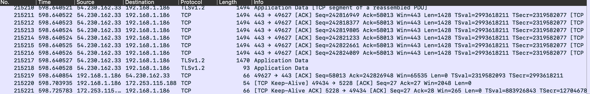

## Packet Sniffing

I actually couldn't copy the full sheet since I ran Wireshark for about 20 minutes and it generated 215,000 lines of information. But, below I have the about 2,000 of those as an example linked in a google sheet.

I did see a few error saying "ACKed unseen segment" where I am assuming the packet arrived uncompleted (although I'm not totally sure about this case, considering it was TCP as are most of the connections). 

Most if not all had the destination of my IP address which was normal since I was doing the readings at the time and was constantly switching through tabs. 

# Check out the full sheet here
[link to google sheet](https://docs.google.com/spreadsheets/d/1kboXTo6Dc3kk6z1ksMVLHwNFOaHZFDUNhlVyEbM6n7c/edit?usp=sharing)